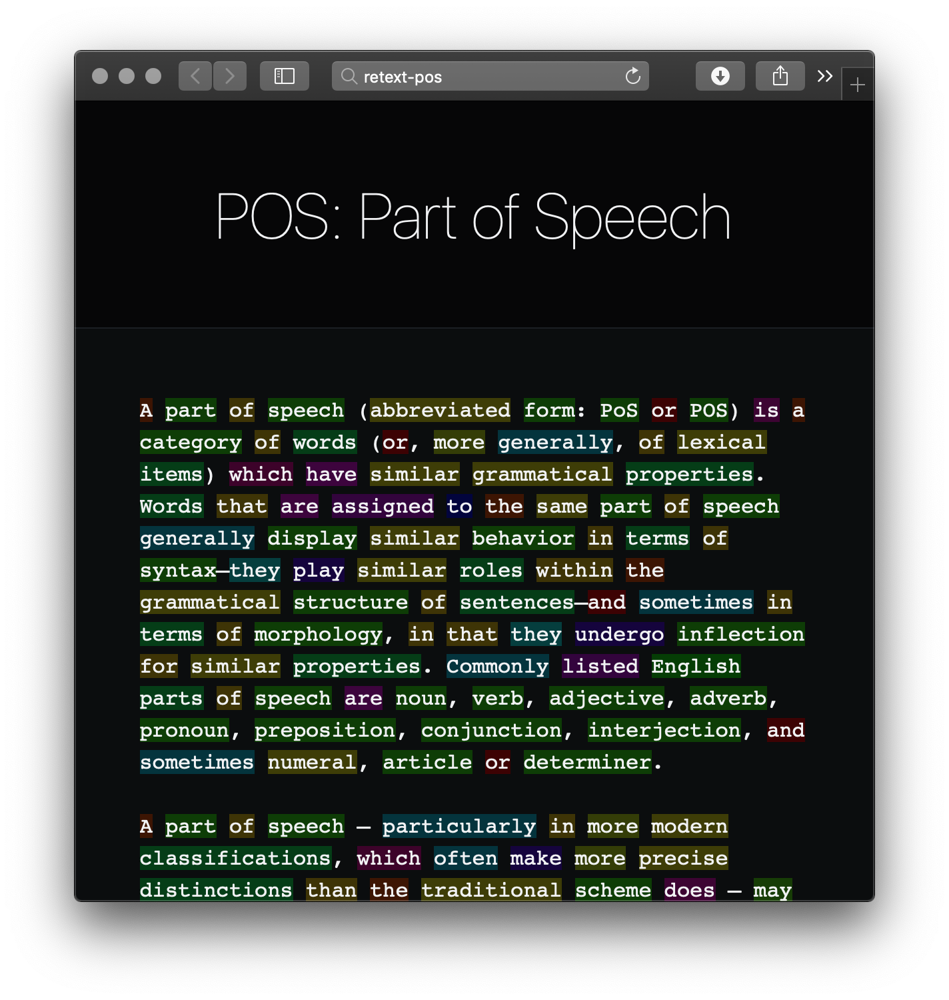

# retext-pos

## Related

*   [readability](https://github.com/wooorm/readability)
*   [write-music](https://github.com/wooorm/write-music)
*   [common-words](https://github.com/wooorm/common-words)
*   [short-words](https://github.com/wooorm/short-words)
